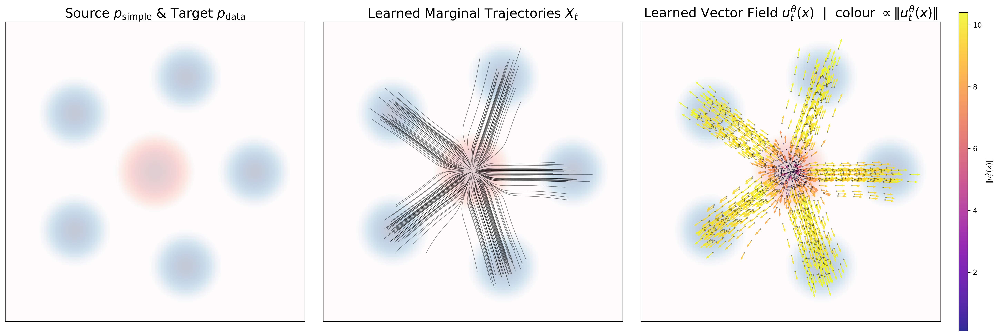
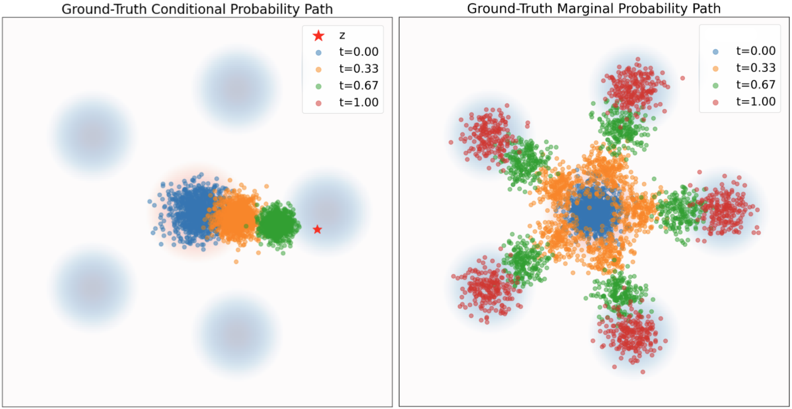
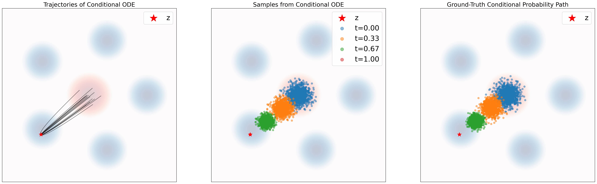
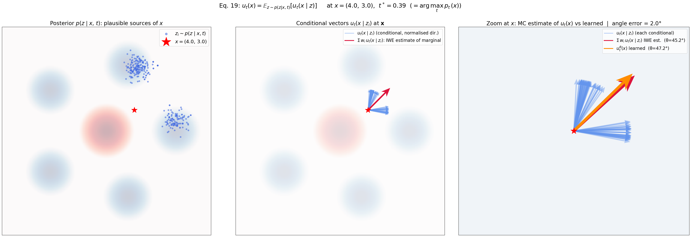

---
title: "Introduction to Flow Matching Model, Part 2 of 3: Constructing the Training Target"
description: "How to construct the training target for flow matching. Covers conditional and marginal probability paths, Gaussian conditional vector fields, and the marginalization trick with proofs and visualizations."
draft: false
math: true
date: 2026-04-12
tags:
  - generative
--- 

# The goal

In the previous section, generation was framed as a transport problem: start from a simple source distribution and move samples through an ODE until they match the data distribution. In flow matching, that transport is governed by a time-dependent vector field. The central question of this section is therefore: **what vector field should we use as the training target?**

For the running toy example, the source distribution is

$$
p_{\text{simple}} = \mathcal{N}(0, I_2),
$$

and the target distribution $p_{\text{data}}$ is a symmetric five-mode Gaussian mixture in $\mathbb{R}^2$. Our goal is to learn a vector field $u_t^\theta(x)$ such that samples drawn from $p_{\text{simple}}$ are transported to $p_{\text{data}}$ by the ODE

$$
\frac{d}{dt}X_t = u_t^\theta(X_t).
$$

<figure>
  
  <figcaption>Figure 1. The toy setup used throughout this section. Left: the source density $p_{\text{simple}}$ (red) and target density $p_{\text{data}}$ (blue). Middle: trajectories induced by the learned marginal ODE. Right: the learned vector field, with colour indicating velocity magnitude.</figcaption>
</figure>

The left panel states the learning problem. The red Gaussian is easy to sample from, but it is not the distribution we want. The blue multimodal density is the data distribution we ultimately want to generate from. The model must learn how to continuously reshape the red cloud into the blue one.

The middle panel shows the global effect of that learned motion rule. Each black curve is one trajectory of the ODE. A single trajectory tells us how one initial sample moves over time; the whole family of trajectories is the flow that transports the source distribution toward the data distribution.

The right panel shows the local object we actually train: the vector field. At every point in space and time, $u_t^\theta(x)$ tells a particle which direction to move and how fast. So if generation is the global transport, the vector field is the local rule that produces it. Constructing the correct training target for this vector field is the task of this section.

# Definition of Probability Path

A **probability path** is a family of distributions $\{p_t\}_{t \in [0,1]}$ indexed by time, where each value of $t$ gives one intermediate distribution between the source and the target:

$$
p_0 = p_{\text{simple}}, \qquad p_1 = p_{\text{data}}.
$$

Instead of specifying only the start and end distributions, a probability path describes the entire transport process across time. You can think of it as a movie of distributions: $p_0$ is the first frame, $p_1$ is the last frame, and the intermediate $p_t$'s describe how the probability mass moves in between.

Figure 2 is meant to give a qualitative feeling for this idea before we introduce more notation. In both panels, the colors mark snapshots at different times: blue for $t=0.00$, orange for $t=0.33$, green for $t=0.67$, and red for $t=1.00$. Reading the colors from blue to red, we see a distribution gradually change shape over time rather than jump directly from source to target.

<figure>
  
  <figcaption>Figure 2. Two visual examples of a probability path. Left: the motion is organized around one fixed target point $z$ (red star). Right: many such transports are averaged together, producing a path for the overall data distribution.</figcaption>
</figure>

The left panel is the more local view. We pick one target point $z$, marked by the red star, and watch how the distribution moves toward that single destination. This gives a **conditional probability path**, written $p_t(\cdot \mid z)$. It is still a probability path in the same basic sense as above, but now the whole story is tied to one chosen endpoint.

The right panel is the more global view. Instead of focusing on one destination, we average over many target points drawn from the data distribution. The resulting family of distributions is the **marginal probability path**, written $p_t(\cdot)$. So the conditional path tells a pointwise transport story, while the marginal path tells the distribution-level story we ultimately care about.

Formally, the marginal path is obtained by averaging conditional paths over the data distribution:

$$
p_t(x) = \int p_t(x \mid z)\, p_{\text{data}}(z)\, dz.
$$

This marginal path is the distribution-level object that matters for generation, because the model only receives $(x,t)$ as input and never observes the hidden variable $z$. In practice, this creates an important asymmetry: **sampling from the marginal probability path** is often easy, but evaluating the marginal density is not. Formally, we can sample from $p_t$ by first drawing a data point and then sampling from the corresponding conditional path:

$$
z \sim p_{\text{data}}, \qquad x \sim p_t(\cdot \mid z)
\quad \Longrightarrow \quad
x \sim p_t.
$$

But computing the density value $p_t(x)$ usually still requires the integral above.

Note that $p_t(\cdot \mid z)$ and $p_t(\cdot)$ denote distributions, while $p_t(x \mid z)$ and $p_t(x)$ denote densities evaluated at a point $x$. In practice people often blur this distinction in notation, but conceptually it is important to keep them separate.

With this picture in place, we can proceed in the natural order: first define a simple conditional probability path, then understand how it induces the marginal path whose vector field we actually want to learn.

# Gaussian Conditional Probability Path

A particularly useful choice is the **Gaussian conditional probability path**

$$
p_t(x \mid z) = \mathcal{N}(x;\, \alpha_t z,\; \beta_t^2 I_d),
$$

where the schedules $\alpha_t$ and $\beta_t$ satisfy

$$
\alpha_0 = 0,\quad \alpha_1 = 1,\quad \beta_0 = 1,\quad \beta_1 = 0.
$$

This path starts from a standard Gaussian at $t=0$ and ends at a point mass at $z$ when $t=1$. In other words, it describes how noise is gradually concentrated onto a target data point.

The key reason this choice is so useful is that it admits a simple reparameterization:

$$
x_t = \alpha_t z + \beta_t \epsilon, \qquad \epsilon \sim \mathcal{N}(0, I_d).
$$

So sampling from the conditional path is easy: scale the target point by $\alpha_t$, scale Gaussian noise by $\beta_t$, and add them together.

Even better, this path gives an analytic conditional vector field. Differentiating the reparameterization with respect to time yields

$$
\dot{x}_t = \dot{\alpha}_t z + \dot{\beta}_t \epsilon.
$$

Using $\epsilon = \frac{x - \alpha_t z}{\beta_t}$, we obtain

$$
u_t^{\text{target}}(x \mid z) =
\dot{\alpha}_t z + \dot{\beta}_t \left(\frac{x - \alpha_t z}{\beta_t}\right) =
\left(\dot{\alpha}_t - \frac{\dot{\beta}_t}{\beta_t}\alpha_t\right) z +
\frac{\dot{\beta}_t}{\beta_t} x.
$$

This is the first major win: for every triplet $(x,t,z)$ sampled from the conditional path, we can evaluate the exact target velocity $u_t^{\text{target}}(x \mid z)$ in closed form. So the conditional problem is tractable.

### Reparameterization Trick / Change of Variable Trick

The change-of-variable step above is simple but important, so it is worth writing out explicitly:

$$\begin{align*}
(i) \Leftrightarrow && \dot{\alpha}_t z + \dot{\beta}_t x &= u_t^{\text{target}}(\alpha_t z + \beta_t x | z) \quad \text{for all } x, z \in \mathbb{R}^d \\
(ii) \Leftrightarrow && \dot{\alpha}_t z + \dot{\beta}_t \left(\frac{x - \alpha_t z}{\beta_t}\right) &= u_t^{\text{target}}(x | z) \quad \text{for all } x, z \in \mathbb{R}^d
\end{align*}$$

Define a new variable

$$ x' = \alpha_t z + \beta_t x $$

Then solve for the old $x$:

$$ x = \frac{x' - \alpha_t z}{\beta_t} $$

Substitute this back into the left-hand side:

$$
\dot{\alpha}_t z + \dot{\beta}_t x =
\dot{\alpha}_t z + \dot{\beta}_t \left(\frac{x' - \alpha_t z}{\beta_t}\right)
$$

At the same time, the right-hand side becomes

$$ u_t^{\mathrm{target}}(x' \mid z) $$

So the equation becomes

$$
\dot{\alpha}_t z + \dot{\beta}_t \left(\frac{x' - \alpha_t z}{\beta_t}\right) =
u_t^{\mathrm{target}}(x' \mid z)
$$

Finally, since $x'$ is just a dummy variable name, rename it back to $x$. Then you get

$$
\dot{\alpha}_t z + \dot{\beta}_t \left(\frac{x - \alpha_t z}{\beta_t}\right) =
u_t^{\mathrm{target}}(x \mid z)
$$

The practical message is that the Gaussian conditional path is not just easy to sample from; it also gives a closed-form velocity field. That makes it an ideal source of supervision.

In the first toy experiment we use the linear schedules

$$
\alpha_t = t, \qquad \beta_t = 1 - t.
$$

With this choice, the coupled sample takes the form

$$
x_t = t z + (1-t) x_0,
$$

so each conditional trajectory becomes a straight interpolation from the initial noise sample $x_0$ to the target point $z$. This is why the conditional trajectories in the next figure appear visually straight.

<figure>
  
  <figcaption>Figure 3. Linear beta schedule: $\alpha_t = t$ and $\beta_t = 1-t$. For a fixed conditioning point $z$ (red star), integrating the analytic conditional ODE reproduces the same intermediate distributions as direct sampling from the Gaussian conditional probability path.</figcaption>
</figure>

If instead we keep the same mean schedule but use the square-root beta schedule from the implementation,

$$
\alpha_t = t, \qquad \beta_t = \sqrt{1-t},
$$

then the conditional path still moves toward the same target point $z$, but the spread contracts according to a different time schedule.

<figure>
  
  <figcaption>Figure 4. Square-root beta schedule: $\alpha_t = t$ and $\beta_t = \sqrt{1-t}$. For a fixed conditioning point $z$ (red star), integrating the analytic conditional ODE reproduces the same intermediate distributions as direct sampling from the Gaussian conditional probability path.</figcaption>
</figure>

Figures 3 and 4 make the conditional story concrete.
In the left panel, the red star is a fixed conditioning data point $z$. The black curves are trajectories generated by integrating the conditional ODE

$$
\frac{d}{dt}X_t = u_t(X_t \mid z).
$$

Because the conditional vector field is known analytically, these trajectories are not learned approximations; they are generated from the exact conditional dynamics.

The middle panel shows samples from that same conditional ODE at several time slices. We begin with samples from $p_{\text{simple}}$, integrate the ODE numerically, and record the particle locations at a few values of $t$.

The right panel shows direct samples from the ground-truth conditional path $p_t(x \mid z)$ at those same time slices. Here no ODE integration is needed: we sample directly from the Gaussian distribution $\mathcal{N}(\alpha_t z, \beta_t^2 I)$.

The key observation is that the middle and right panels match in both figures. So the conditional ODE and the conditional probability path describe the same evolving distribution under either schedule. This gives us confidence that the conditional vector field really is the correct transport rule for the chosen path.

# From Conditional to Marginal Probability Path

The conditional story is tractable, but it is not yet the object we ultimately want to learn. A flow model takes only $(x,t)$ as input, so the appropriate target must also depend only on $(x,t)$. That means the desired object is the **marginal vector field** associated with the marginal path

$$
p_t(x) = \int p_t(x \mid z)\, p_{\text{data}}(z)\, dz.
$$

This is where the difficulty appears.

Sampling from the marginal path is easy: first draw $z \sim p_{\text{data}}$, then draw $x \sim p_t(x \mid z)$. But evaluating the marginal density $p_t(x)$ is generally intractable, because it requires integrating over all possible data points $z$. For the same reason, the marginal vector field is not available in closed form.

As stated in Theorem 10 ("Marginalization trick") from [1]:
> Theorem 10 (Marginalization trick)  
> For every data point $z \in \mathbb{R}^d$, let $u_t^{\text{target}}(x \mid z)$ denote a conditional vector field, defined so that the corresponding ODE yields the conditional probability path $p_t(\cdot \mid z)$:

$$
X_0 \sim p_{\text{simple}}, \qquad \frac{d}{dt}X_t = u_t^{\text{target}}(X_t \mid z)
\quad \Longrightarrow \quad
X_t \sim p_t(\cdot \mid z). \tag{18}
$$

> Then the marginal vector field $u_t^{\text{target}}(x)$, defined by

$$
u_t^{\text{target}}(x) =
\int u_t^{\text{target}}(x \mid z)\,
\frac{p_t(x \mid z)\, p_{\text{data}}(z)}{p_t(x)}\,dz \tag{19}
$$

> follows the marginal probability path, i.e.

$$
X_0 \sim p_{\text{simple}}, \qquad \frac{d}{dt}X_t = u_t^{\text{target}}(X_t)
\quad \Longrightarrow \quad
X_t \sim p_t. \tag{20}
$$

By Bayes' rule,

$$
\frac{p_t(x \mid z)\, p_{\text{data}}(z)}{p_t(x)}=p(z \mid x, t),
$$

so the same formula can also be written as

$$
u_t^{\text{target}}(x)=\mathbb{E}_{z \sim p(z \mid x, t)}\left[u_t^{\text{target}}(x \mid z)\right].
$$

$p(z\mid x,t)$ has a simple interpretation: if we observe a particle currently at location $x$ at time $t$, how plausible is each target data point $z$ as the hidden destination that produced it? The correct marginal velocity at $(x,t)$ is obtained by averaging all conditional velocities, weighted by this posterior plausibility.

This is the key payoff: although we cannot directly write down the marginal vector field from the marginal density, we can construct it indirectly from conditional vector fields that are easy to analyze. In other words, conditional paths are the tractable local pieces, and the marginalization trick assembles them into the global transport rule we actually need.

# Continuity equation intuition

The deeper reason why Equation (19) holds comes from the **continuity equation**, as stated in Theorem 12 ("Continuity Equation") from [1]:
> Theorem 12 (Continuity Equation)  
> Let us consider a flow model with vector field $u_t^{\mathrm{target}}$ with $X_0 \sim p_{\mathrm{init}}$. Then $X_t \sim p_t$ for all $0 \le t \le 1$ if and only if

$$
\partial_t p_t(x) = -\operatorname{div}\bigl(p_t u_t^{\mathrm{target}}\bigr)(x)
\quad \text{for all } x \in \mathbb{R}^d,\ 0 \le t \le 1, \tag{24}
$$

> where $\partial_t p_t(x) = \frac{d}{dt}p_t(x)$ denotes the time-derivative of $p_t(x)$. Equation 24 is known as the continuity equation.

Equation (24) says that the density changes only because probability mass flows through space.

Here $u_t(x)$ is a vector field, while $p_t(x)$ is a scalar density. Their product

$$
p_t(x)u_t(x)
$$

is therefore a vector field called the **probability flux**. It tells us how much probability mass is moving, and in which direction.

The divergence

$$
\operatorname{div}(p_tu_t)(x)
$$

measures the net outward flow near $x$.

- If more probability flows out of a neighbourhood than into it, the density there decreases.
- If more probability flows in than out, the density there increases.

So the continuity equation is the distribution-level law that links a vector field to the probability path it transports.

### From the continuity equation to Equation (19)

Each conditional path satisfies its own continuity equation:

$$
\partial_t p_t(x \mid z) = -\operatorname{div}\bigl(p_t(x \mid z)\,u_t(x \mid z)\bigr).
$$

Multiply both sides by $p_{\text{data}}(z)$ and integrate over $z$:

$$
\int \partial_t p_t(x \mid z)\, p_{\text{data}}(z)\, dz =
-\int \operatorname{div}\bigl(p_t(x \mid z)\,u_t(x \mid z)\bigr)\, p_{\text{data}}(z)\, dz.
$$

Since the integral is over $z$ while the divergence acts on $x$, the two operations can be exchanged:

$$
\partial_t p_t(x) =
-\operatorname{div}\left(\int p_t(x \mid z)\,u_t(x \mid z)\, p_{\text{data}}(z)\, dz\right).
$$

But the marginal path also satisfies a continuity equation,

$$
\partial_t p_t(x) = -\operatorname{div}\bigl(p_t(x)u_t(x)\bigr),
$$

so we identify the corresponding probability flux:

$$
p_t(x)u_t(x) =
\int p_t(x \mid z)\,u_t(x \mid z)\, p_{\text{data}}(z)\, dz.
$$

Finally, divide both sides by $p_t(x)$:

$$
u_t(x) =
\int \frac{p_t(x \mid z)\, p_{\text{data}}(z)}{p_t(x)}\, u_t(x \mid z)\, dz =
\int p(z \mid x,t)\, u_t(x \mid z)\, dz.
$$

This is exactly Equation (19). So the marginalization trick is not ad hoc; it is a direct consequence of how probability mass must evolve under the continuity equation.

# A Visual Demonstration of the Marginalization Trick
The goal of the flow matching model is to learn the marginal vector field. In this toy experiment, we assume that the model has learned this field accurately enough that its output at the query point can be used as an approximation to the marginal vector field. Figure 5 then compares this learned vector with the posterior-weighted average of the conditional vector fields, providing a visual demonstration of Equation (19).

<figure>
  
  <figcaption>Figure 5. A visual demonstration of Equation (19): at a query point $x$, the posterior-weighted average of many conditional vector fields gives the marginal vector field, and the learned model closely matches that average. The code for generating these visualizations and reproducing the experiments can be found in the companion repository [2].</figcaption>
</figure>

| Arrow | What it represents |
|---|---|
| Cornflower blue (fan) | Individual conditional vectors $u_t(x \mid z_i)$ from plausible sources of $x$ |
| **Crimson** | Monte Carlo estimate of the marginal vector in Eq. 19 |
| **Orange** | Learned prediction $u_t^\theta(x)$ at the same $(x,t)$ |

The key comparison is between the crimson and orange arrows. The crimson arrow is not an independent ground truth; it is Eq. 19 evaluated numerically at that point. When it aligns with the orange arrow, the visualization confirms the main claim of this article: the model has learned to reproduce the posterior average of conditional fields implicitly, even though training only uses local supervision on $(z, x_t)$ pairs.

Equation (19), derived in the previous section, is the conceptual core of Conditional Flow Matching:
$$
u_t^{\text{target}}(x) = \mathbb{E}_{z \sim p(z \mid x,\, t)}\!\left[\, u_t^{\text{target}}(x \mid z)\,\right]
$$

The flow matching model is supposed to learn the vector field $u_t^{\text{target}}(x)$. The difficulty is that the expectation is taken over the posterior $p(z \mid x,t)$, so evaluating it exactly would require integrating over all of $p_{\text{data}}$, which is intractable. Figure 5 makes this abstract identity concrete at one query point $x$: the marginal vector field is the posterior average of many conditional vector fields, and the learned model can match that average.

# How Figure 5 Demonstrates the Marginalization Trick
The goal of this section is not merely to explain how Figure 5 is drawn, but to show how the visualization is constructed to compare the learned model output with the posterior-weighted average of conditional vector fields. By unpacking each part of the construction, we gain deeper intuition for why this comparison provides a visual demonstration of Equation (19).

To draw this figure, we still have to answer two practical questions that Eq. 19 leaves implicit:

1. Which time $t$ should we use for the chosen query point $x$?
2. How do we approximate the posterior expectation numerically?

The rest of this section explains those two steps.

### From Equation 19 to a Computable Arrow

The crimson arrow is obtained by using Eq. 19 itself as a Monte Carlo recipe:

$$
u_t^{\text{target}}(x)
  \;=\; \mathbb{E}_{z \sim p(z|x,t)}\!\left[u_t(x\mid z)\right]
  \;\approx\; \frac{1}{M}\sum_{i=1}^{M} u_t(x \mid z_i),
  \qquad z_i \sim p(z \mid x, t)
$$

So the crimson arrow is not an external label; it is Eq. 19 evaluated numerically at that specific point.

### Why the Header Shows $t^* = 0.39$

This subsection explains the $t^*$ shown in the header of Figure 5. In that figure, $t^* = 0.39$.

In the generative process, the order is fixed:
$$
z \sim p_{\text{data}} \;\longrightarrow\; t \sim \text{Uniform}[0,1) \;\longrightarrow\; x \sim p_t(x \mid z) = \mathcal{N}(\alpha_t z,\, \beta_t^2 I).
$$

$x$ is **derived** from $z$ and $t$, so once we fix a query point $x$ for visualization, we cannot choose an arbitrary time slice and expect the posterior $p(z \mid x,t)$ to be meaningful. If $x$ has near-zero density under $p_t(x)$, the posterior becomes nearly empty, the importance weights collapse onto one proposal, and the resulting visualization is mostly noise.

For that reason, the figure first searches for a "natural" time slice for the chosen $x$. For each candidate $t$, it estimates
$$
p_t(x) = \int p_t(x \mid z)\, p_{\text{data}}(z)\, dz \;\approx\; \frac{1}{K} \sum_{i=1}^{K} p_t(x \mid z_i), \qquad z_i \sim p_{\text{data}},
$$
and then selects
$$
t^* = \arg\max_{t \in [0,1)} \hat{p}_t(x)
$$

This picks the time at which the chosen $x$ is most compatible with the probability path.

In the implementation, this grid search over $t \in [0.02, 0.98]$ is performed automatically before visualization, so $t$ is not exposed as a user argument.

### Approximating the Posterior with Importance Sampling

Once $t^*$ has been fixed, we still need to approximate the posterior expectation in Eq. 19. Ideally we would sample from $p(z \mid x,t)$ directly, but this is not feasible because the normalizer
$$
p_t(x) = \int p_t(x \mid z)\,p_{\text{data}}(z)\,dz
$$
is intractable.

Importance sampling solves this by drawing proposals from $p_{\text{data}}$ and reweighting them. For any function $f$,

$$
\mathbb{E}_{z \sim p(z|x,t)}[f(z)]
= \mathbb{E}_{z \sim p_{\text{data}}}\!\left[f(z)\cdot \underbrace{\frac{p(z \mid x,t)}{p_{\text{data}}(z)}}_{\text{importance weight } w}\right]
$$

Using Bayes' rule and the fact that the proposal distribution is exactly $p_{\text{data}}$, the weight simplifies to

$$
w_i
= \frac{p(z_i \mid x,t)}{p_{\text{data}}(z_i)}
= \frac{p_t(x \mid z_i)\;\cancel{p_{\text{data}}(z_i)}}{\underbrace{p_t(x)}_{\text{const. in }z_i}\;\cancel{p_{\text{data}}(z_i)}}
\;\propto\; p_t(x \mid z_i) = \mathcal{N}(x;\;\alpha_t z_i,\;\beta_t^2 I)
$$

The factor $p_t(x)$ disappears after normalization because, once $x$ and $t$ are fixed, it is the same constant for every proposal $z_i$. This is precisely why importance sampling is useful here: the intractable normalizer never has to be computed explicitly.

Intuitively, the weight asks *"if $z_i$ were the true source point, how likely would the noisy interpolation be to land at the observed query point $x$?"*
- $z_i$ near $x / \alpha_t$ → Gaussian centered close to $x$ → **high weight**
- $z_i$ far from $x / \alpha_t$ → near-zero weight, effectively discarded

### From Weighted Proposals to the Arrows and Scatter

Once we have normalized weights $w_i \propto p_t(x \mid z_i)$, we use them in two different ways.

To estimate the **marginal vector field** at the fixed location $x$, we evaluate the conditional field for every proposal $z_i$ and take the weighted average:
$$
\hat{u}_t(x) = \sum_{i=1}^{N} w_i \cdot u_t(x \mid z_i), \qquad w_i = \text{softmax}(\log p_t(x \mid z_i))_i
$$
This directly approximates
$$
\mathbb{E}_{z \sim p(z \mid x,t)}[u_t(x \mid z)].
$$
So the crimson arrow is the posterior-weighted average of all the conditional arrows.

For the **Panel 1 scatter plot**, the goal is different. We do not want a single averaged vector; we want a cloud of points that visually behaves like samples from $p(z \mid x,t)$. To get that, we resample $M \ll N$ indices from the proposals according to the weights and then work with the resampled points:
$$
\hat{u}_t(x) = \frac{1}{M} \sum_{i=1}^{M} u_t(x \mid \tilde{z}_i), \qquad \tilde{z}_i \sim \text{Multinomial}(\{z_i\}, \{w_i\})
$$
For the visualization, we simply scatter the resampled points $\tilde{z}_i$ directly.

These two uses of the same weights serve different purposes. The weighted average is better for estimating the vector because it keeps the exact contribution of every proposal. Resampling would throw away some of that information and add extra sampling noise. For visualization, however, resampling is exactly what we want: it converts weighted proposals into an ordinary point cloud that behaves approximately like posterior samples. This is why Figure 5 uses a weighted average for the crimson arrow but resampled points for the scatter plot. Since the conditional field is available in closed form, evaluating it on all $N = 30{,}000$ proposals is essentially free.

# Summary

In the previous article, *The Machinery of Generation*, we explored the fundamental mechanics of generative models, uncovering the key insight that generation is essentially a process of sampling followed by transformation—specifically, using Ordinary Differential Equations (ODEs) and their simulation as the mathematical tool for this transformation. Building on that foundation, this article focused on defining the ground truth for our models—including its mathematical proofs—and detailing how to actually construct it.

To achieve this, we introduced the concept of a *probability path* to describe the transformation from the initial distribution ($p_{\text{init}}$) to the data distribution ($p_{\text{data}}$). We then analytically used this path to derive the ground truth vector field needed for the ODE simulation. We demonstrated that the true target for our training is the conditional vector field, rather than the marginal one, and explained how the marginal vector field can be estimated through marginalization. We supported this by analytically proving the relationship between conditional and marginal vector fields using the Continuity Equation, a fundamental result from physics. Finally, we showed qualitatively that even though the model is trained exclusively on the conditional vector field, it implicitly learns to perform this marginalization trick.

# References

[1] Peter Holderrieth and Ezra Erives. *Introduction to Flow Matching and Diffusion Models*. 2025. <https://diffusion.csail.mit.edu/>

[2] Bai-YunHan. *Companion code for Introduction to Flow Matching Model*. GitHub repository. <https://github.com/Bai-YunHan/Companion-code-for-Introduction-to-Flow-Matching-Model>
