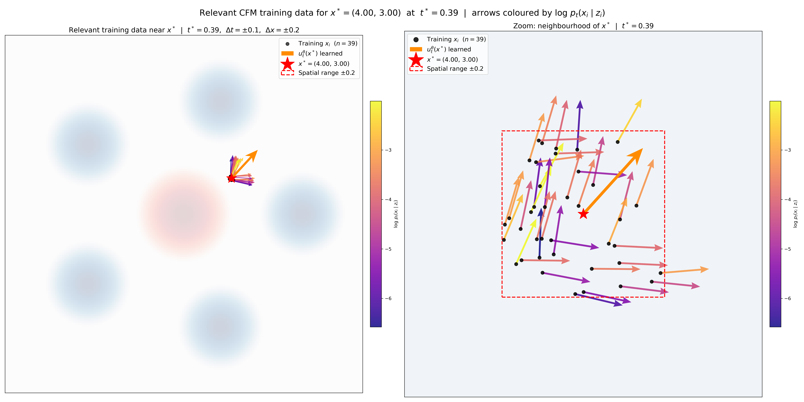
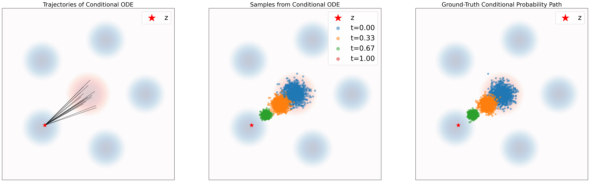

---
title: "Introduction to Flow Matching Model, Part 3 of 3: Constructing the Training Loss"
draft: false
math: true
date: 2026-04-12
tags:
  - generative
--- 

# Constructing the Training Loss

Section 1 framed generative modeling as sampling through transformation: start from a simple distribution and transport samples toward the data distribution by integrating an ODE. In that picture, the learned vector field is the local motion rule, and the induced flow is the global transformation that turns noise into data.

Section 2 then showed how to construct the relevant target vector field. By introducing conditional and marginal probability paths, we obtained a closed-form expression for the tractable conditional vector field $u_t^{\text{target}}(x \mid z)$ and saw, via the marginalization trick, how these conditional fields assemble into the marginal vector field $u_t^{\text{target}}(x)$ that actually governs the distribution-level transport.

This leaves the next question: even if we know which vector field we want in principle, how do we train a neural network to learn it in practice? That is the problem of this section.

# The Problem
As we learned, we want the neural network $u_t^\theta$ to approximate the marginal vector field $u_t^{\text{target}}$. A natural way to achieve this is to use a mean-squared-error objective, namely the **flow matching loss** defined as

Here, $\text{Unif} = \text{Unif}_{[0,1]}$ denotes the uniform distribution on $[0,1]$, and $\mathbb{E}$ denotes expectation.

$$\mathcal{L}_{\text{FM}}(\theta) = \mathbb{E}_{t \sim \text{Unif}, x \sim p_t}[\|u_t^\theta(x) - u_t^{\text{target}}(x)\|^2] \tag{1}$$

$$\overset{(i)}{=} \mathbb{E}_{t \sim \text{Unif}, z \sim p_{\text{data}}, x \sim p_t(\cdot|z)}[\|u_t^\theta(x) - u_t^{\text{target}}(x)\|^2]$$

where $p_t(x) = \int p_t(x|z) p_{\text{data}}(z) \mathrm{d}z$ is the marginal probability path and in $(i)$ we used the following **sampling from marginal path** procedure:
$$
z \sim p_{\text{data}}, \qquad x \sim p_t(\cdot \mid z) \qquad \Longrightarrow \qquad x \sim p_t.
$$
**Intuitively, this loss says**: First, draw a random time $t \in [0,1]$. Second, draw a random point $z$ from our data set, sample $x \sim p_t(\cdot|z)$ (e.g., by **adding** some noise), and compute $u_t^\theta(x)$. Finally, compute the mean-squared error between the output of our neural network and the marginal vector field $u_t^{\text{target}}(x)$. However, we are still not done. Although Theorem 10 in [1] gives the marginalization-trick formula for $u_t^{\text{target}}$,

$$u_t^{\text{target}}(x) = \int u_t^{\text{target}}(x|z) \frac{p_t(x|z) p_{\text{data}}(z)}{p_t(x)} \mathrm{d}z, \tag{2}$$

we cannot compute it efficiently because the above integral is intractable. Instead, we will exploit the fact that the **conditional** velocity field $u_t^{\text{target}}(x|z)$ is tractable. This leads to the **conditional flow matching loss**

$$\mathcal{L}_{\text{CFM}}(\theta) = \mathbb{E}_{t \sim \text{Unif}, z \sim p_{\text{data}}, x \sim p_t(\cdot|z)}[\|u_t^\theta(x) - u_t^{\text{target}}(x|z)\|^2]$$

Note the difference to $\mathcal{L}_{\text{FM}}(\theta)$ in eq. (1): we use the conditional vector field $u_t^{\text{target}}(x|z)$ instead of the marginal vector field $u_t^{\text{target}}(x)$. As we have an analytical formula for $u_t^{\text{target}}(x|z)$, we can minimize the above loss easily.

But wait, what sense does it make to regress against the conditional vector field if it's the marginal vector field we care about? As it turns out, by *explicitly* regressing against the tractable, conditional vector field, we are *implicitly* regressing against the intractable, marginal vector field. The next result makes this intuition precise.

<figure>
  
  <figcaption>Figure 1. Comparison of Learned Marginal Probability Path and Ground Truth.</figcaption>
</figure>

- **Panel 1 (Trajectories of Learned Marginal ODE):** We use the learned marginal vector field $u_t^\theta$ to plot the trajectory using ODE simulation. Starting from initial samples $x_0 \sim p_{\text{simple}}$, we integrate the learned vector field over time using an ODE solver (e.g., Euler method).
- **Panel 2 (Samples from Learned Marginal ODE):** The samples are generated using the trajectory by extracting the points along the simulated ODE trajectories from Panel 1 at specific time steps $t$. Note that the samples appear denser here than the trajectories in Panel 1 because only a limited number of trajectories are drawn in Panel 1 for cleaner visualization.
- **Panel 3 (Ground-Truth Marginal Probability Path):** Even though we cannot compute the marginal density $p_t(x)$ directly because the integral is intractable, we can still get the ground truth sample using the marginalization trick:
  $$
  z \sim p_{\text{data}}, \qquad x \sim p_t(\cdot \mid z) \quad \Longrightarrow \quad x \sim p_t.
  $$
  In the implementation [2], this is done by sampling a target data point $z$ and then sampling $x$ from the conditional distribution $p_t(\cdot|z)$. Because we use a Gaussian conditional probability path, $x \sim p_t(\cdot|z)$ is easily computable as $x = \alpha_t z + \beta_t \epsilon$ where $\epsilon \sim \mathcal{N}(0, I)$.

# Equivalence of CFM and FM Objectives: Algebraic Proof
As we can see, the samples from the learned marginal ODE visually match the ground-truth probability path. This suggests that, although we train against the tractable conditional vector field $u_t^{\text{target}}(x|z)$, the learned model still recovers the marginal behavior governed by $u_t^{\text{target}}(x)$.

> **Theorem 18.** The marginal flow matching loss equals the conditional flow matching loss up to a constant. That is,
>
> $$
> \mathcal{L}_{\text{FM}}(\theta) = \mathcal{L}_{\text{CFM}}(\theta) + C,
> $$
>
> where $C$ is independent of $\theta$. Therefore, their gradients coincide:
>
> $$
> \nabla_\theta \mathcal{L}_{\text{FM}}(\theta) = \nabla_\theta \mathcal{L}_{\text{CFM}}(\theta).
> $$
>
> Hence, minimizing $\mathcal{L}_{\text{CFM}}(\theta)$ with stochastic gradient descent (SGD) is equivalent to minimizing $\mathcal{L}_{\text{FM}}(\theta)$ in the same fashion. In particular, for the minimizer $\theta^*$ of $\mathcal{L}_{\text{CFM}}(\theta)$, it will hold that $u_t^{\theta^*} = u_t^{\text{target}}$ (assuming an infinitely expressive parameterization). [1]

**Proof.** The proof works by expanding the mean-squared error into three components and removing constants. [1]

$$
\begin{aligned}
\mathcal{L}_{\text{FM}}(\theta)
&\overset{(i)}{=}
\mathbb{E}_{t \sim \text{Unif}, x \sim p_t}
\left[\left\|u_t^\theta(x) - u_t^{\text{target}}(x)\right\|^2\right] \\
&\overset{(ii)}{=}
\mathbb{E}_{t \sim \text{Unif}, x \sim p_t}
\left[\left\|u_t^\theta(x)\right\|^2 - 2\,u_t^\theta(x)^\top u_t^{\text{target}}(x) + \left\|u_t^{\text{target}}(x)\right\|^2\right] \\
&\overset{(iii)}{=}
\mathbb{E}_{t \sim \text{Unif}, x \sim p_t}\left[\left\|u_t^\theta(x)\right\|^2\right]
- 2\mathbb{E}_{t \sim \text{Unif}, x \sim p_t}\left[u_t^\theta(x)^\top u_t^{\text{target}}(x)\right]
+ \underbrace{\mathbb{E}_{t \sim \text{Unif}_{[0,1]}, x \sim p_t}\left[\left\|u_t^{\text{target}}(x)\right\|^2\right]}_{=:C_1} \\
&\overset{(iv)}{=}
\mathbb{E}_{t \sim \text{Unif}, z \sim p_{\text{data}}, x \sim p_t(\cdot|z)}
\left[\left\|u_t^\theta(x)\right\|^2\right]
- 2\,{\color{green}\boxed{\color{white}{\mathbb{E}_{t \sim \text{Unif}, x \sim p_t}\left[u_t^\theta(x)^\top u_t^{\text{target}}(x)\right]}}} + C_1
\end{aligned}
$$

where $(i)$ holds by definition, in $(ii)$ we used the formula

$$
\|a-b\|^2 = \|a\|^2 - 2a^\top b + \|b\|^2,
$$

in $(iii)$ we define a constant $C_1$, and in $(iv)$ we used the sampling procedure of 
$p_t$ given by eq. $(13)$. 

$$\underbrace{\mathbb{E}_{t \sim \text{Unif}_{[0,1]}, x \sim p_t}\left[\left\| u_t^{\text{target}}(x) \right\|^2\right]}_{=: C_1}$$
In (iii), the reason the last part is a constant is that it does not depend on the model parameters $\theta$, while the first two terms involve $u_t^{\theta}(x)$.

Let us reexpress the second summand:

$$
\begin{aligned}
{\color{green}\boxed{{\color{white}\mathbb{E}_{{\color{orange}t \sim \text{Unif}, x \sim p_t}}\left[u_t^\theta(x)^\top\right]}}}
\color{pink}{u_t^{\text{target}}(x)}
&\overset{(i)}{=}
\int_0^1 \int p_t(x)\, u_t^\theta(x)^\top u_t^{\text{target}}(x)\,\mathrm{d}x\,\mathrm{d}t \\
&\overset{(ii)}{=}
\int_0^1 \int \cancel{p_t(x)}\, u_t^\theta(x)
{\color{red}\boxed{{\color{white}\left[\int u_t^{\text{target}}(x|z)\frac{p_t(x|z)p_{\text{data}}(z)}{\cancel{p_t(x)}}\,\mathrm{d}z\right]}}}
\,\mathrm{d}x\,\mathrm{d}t \\
&\overset{(iii)}{=}
\int_0^1 \int \int u_t^\theta(x)^\top u_t^{\text{target}}(x|z)\, p_t(x|z)\, p_{\text{data}}(z)\,\mathrm{d}z\,\mathrm{d}x\,\mathrm{d}t \\
&\overset{(iv)}{=}
\mathbb{E}_{\color{orange}{t \sim \text{Unif}, z \sim p_{\text{data}}}, x \sim p_t(\cdot|z)}
\left[
u_t^\theta(x)^\top
\color{pink}{u_t^{\text{target}}(x|z)}
\right]
\end{aligned}
$$

where in $(i)$ we expressed the expected value as an integral, in $(ii)$ we use eq. $(2)$, in $(iii)$ we use the fact that integrals are linear, and in $(iv)$ we express the integral as an expected value.

Note that this was really the **crucial step** of the proof:

> The beginning of the equality used the marginal vector field $u^{\text{target}}_t(x)$, while the end uses the conditional vector field $u^{\text{target}}_t(x|z)$.

Regarding (iii), it says integral is linear, let's get to the definition of linearity.

For an operator $T$, it is **linear** if for any functions $f, g$ and scalars $a, b$,
$$
T(af + bg) = aT(f) + bT(g).
$$

This combines two properties:
- **Additivity**: $T(f + g) = T(f) + T(g)$
- **Homogeneity**: $T(af) = aT(f)$

We plug is into the equation for L FMto get:

$$
\begin{aligned}
\mathcal{L}_{\text{FM}}(\theta)
&\overset{(i)}{=}
\mathbb{E}_{t \sim \text{Unif}, z \sim p_{\text{data}}, x \sim p_t(\cdot|z)}
\left[\left\|u_t^\theta(x)\right\|^2\right]
- 2\mathbb{E}_{t \sim \text{Unif}, z \sim p_{\text{data}}, x \sim p_t(\cdot|z)}
\left[u_t^\theta(x)^\top u_t^{\text{target}}(x|z)\right]
+ C_1 \\
&\overset{(ii)}{=}
\mathbb{E}_{t \sim \text{Unif}, z \sim p_{\text{data}}, x \sim p_t(\cdot|z)}
\left[
\left\|u_t^\theta(x)\right\|^2
- 2u_t^\theta(x)^\top u_t^{\text{target}}(x|z)
{\color{cyan}+ \left\|u_t^{\text{target}}(x|z)\right\|^2}
{\color{red}- \left\|u_t^{\text{target}}(x|z)\right\|^2}
\right]
+ C_1 \\
&\overset{(iii)}{=}
\mathbb{E}_{t \sim \text{Unif}, z \sim p_{\text{data}}, x \sim p_t(\cdot|z)}
\left[\left\|u_t^\theta(x) - u_t^{\text{target}}(x|z)\right\|^2\right]
+ \underbrace{\mathbb{E}_{t \sim \text{Unif}, z \sim p_{\text{data}}, x \sim p_t(\cdot|z)}
\left[-\left\|u_t^{\text{target}}(x|z)\right\|^2\right]}_{C_2}
+ C_1 \\
&\overset{(iv)}{=}
\mathcal{L}_{\text{CFM}}(\theta) + \underbrace{C_2 + C_1}_{=:C}.
\end{aligned}
$$

where in $(i)$ we plugged in the derived equation, in $(ii)$ we added and subtracted the same value, in $(iii)$ we used the formula $\|a-b\|^2 = \|a\|^2 - 2a^\top b + \|b\|^2$ again, and in $(iv)$ we defined a constant in $\theta$. This finishes the proof.

Once $u_t^\theta$ has been trained, we may simulate the flow model

$$
\mathrm{d}X_t = u_t^\theta(X_t)\,\mathrm{d}t,
\qquad
X_0 \sim p_{\text{init}}
$$

via, e.g., algorithm 1 to obtain samples $X_1 \sim p_{\text{data}}$. Let us now instantiate the conditional flow matching loss for the choice of Gaussian probability paths:

# Why Conditional Training Recovers the Marginal Field: Visual View

## The Apparent Contradiction

Training minimizes the CFM loss:
$$\mathcal{L}_{\text{CFM}}(\theta) = \mathbb{E}_{t,\, z \sim p_{\text{data}},\, x \sim p_t(x|z)} \left[\| u_t^\theta(x, t) - u_t^{\text{target}}(x|z) \|^2 \right]$$

Each training sample provides a *conditional* target $u_t(x|z)$ — yet the trained model learns the *marginal* vector field $u_t(x) = \mathbb{E}_{z \sim p(z|x,t)}[u_t(x|z)]$. Why?

## Training Data Sparsity and the Contradiction Made Visible

The following visualization calls `visualize_relevant_training_data`, which zooms into the neighbourhood of the query point $x^*$ at the optimal time $t^*$ and displays only the training samples within a small spatial and time window. The plot simultaneously reveals two things:

**1. Training data sparsity.** Only a handful of points (here, $n=39$) land near any specific $(x, t)$ location. Many fall outside the bounding box entirely. Despite this, the model converges to the correct marginal vector field because neural network generalization covers the $(x, t)$ input space smoothly.

**2. The contradiction made visible.** Each colour-coded arrow is the conditional target $u_t(x_i | z_i)$ for a nearby training sample, coloured by $\log p_t(x_i | z_i)$ (plasma colormap: bright yellow = high likelihood, dark purple = low). Because each $z_i$ is different, the arrows scatter in conflicting directions — even though the inputs $(x_i, t_i)$ are nearly identical. This is the contradiction: the model receives a single input $(x, t)$ but is asked to match many different targets simultaneously. The orange arrow — the learned $u_t^\theta(x^*)$ — is a posterior average of conditional vector field as proved by last visualization. This is not a coincidence: since $z$ is never passed to the model, the L2 loss has no other choice but to pull $u_t^\theta(x, t)$ toward $\mathbb{E}_{z \sim p(z|x,t)}[u_t(x|z)]$, which is exactly the marginal vector field $u_t^{\text{target}}(x)$.

<figure>
  
  <figcaption>Figure 2. Visualization of training data.</figcaption>
</figure>

<figure>
  
  <figcaption>Figure 3. Visualization of relevant training data.</figcaption>
</figure>

## The Key: $z$ is Hidden from the Model

The model signature is $u_t^\theta(x, t)$ — it takes only $(x, t)$ as input, never $z$.

During training, $z$ appears in the data only to **compute the supervision target** $u_t(x|z)$; it is discarded and never passed to the network. This creates a fundamental information bottleneck.

| Quantity | Available to the model during training | Available at inference |
|---|---|---|
| $x$ | Yes (input) | Yes (input) |
| $t$ | Yes (input) | Yes (input) |
| $z$ | No — used only to compute target, then discarded | No |
| $u_t(x\|z)$ | Yes — as the loss target | No |

## Why Hidden $z$ Forces the Model to Learn the Marginal - "Visual"

For any fixed input $(x, t)$, many different $z$'s are compatible with that $x$ at that time (because $\beta_t > 0$ at intermediate times, so the Gaussian clouds overlap). The model must emit a **single output vector** for all those different $z$'s, but the training targets $u_t(x|z_1), u_t(x|z_2), \ldots$ all point in different directions.

This is a standard regression problem with a hidden variable. The fundamental result is:

> The minimizer of $\mathbb{E}[(y - c)^2]$ over a constant $c$ (one that cannot depend on the hidden variable) is $c^* = \mathbb{E}[y]$.

Here $y = u_t(x|z)$ and $c = u_t^\theta(x, t)$ is constant with respect to $z$. So the L2-optimal prediction is:
$$u_t^{\theta*}(x, t) = \mathbb{E}_{z \sim p(z|x,t)}\left[ u_t(x|z) \right] = u_t^{\text{target}}(x)$$

The model cannot "pick a side" when it cannot see which $z$ generated the sample. The averaging is a direct consequence of the L2 loss geometry combined with the hidden $z$.

## Connection to Theorem 18 (Algebraic View)

Theorem 18 arrives at the same conclusion by expanding the CFM loss:
$$\|u_t^\theta - u_t(x|z)\|^2 = \|u_t^\theta - u_t(x)\|^2 + 2(u_t^\theta - u_t(x))\cdot\underbrace{(u_t(x) - u_t(x|z))}_{\text{zero mean over } z|x,t} + \underbrace{\|u_t(x) - u_t(x|z)\|^2}_{\text{constant in } \theta}$$

Taking $\mathbb{E}_{z \sim p(z|x,t)}[\cdot]$: the cross-term vanishes because $\mathbb{E}[u_t(x|z) \mid x,t] = u_t(x)$, and the last term is independent of $\theta$. Therefore $\nabla_\theta \mathcal{L}_{\text{CFM}} = \nabla_\theta \mathcal{L}_{\text{FM}}$ — same gradients, same minimizer.

The two perspectives are two sides of the same coin:
- **Regression view**: hidden $z$ + L2 loss → forced averaging → learns marginal.
- **Algebraic view (Theorem 18)**: cross-term vanishes in expectation → $\mathcal{L}_{\text{CFM}}$ and $\mathcal{L}_{\text{FM}}$ share the same minimizer.

## Why Sparse Training Data is Sufficient

The two effects play distinct roles:

| Effect | What space is covered | What it explains |
|---|---|---|
| **Hidden $z$ + L2 averaging** | Coverage of $z$'s at a fixed $(x,t)$ | *What* the model converges to: the marginal $u_t(x)$ |
| **Neural network generalization** | Coverage of the $(x,t)$ input space | *How efficiently* training reaches that target from finite data |

Even though the training set is a finite sample, the MLP generalizes smoothly across $(x,t)$ space, so optimizing the loss on sampled mini-batches still drives $u_t^\theta$ toward the true minimizer everywhere. Generalization is a prerequisite — it ensures sensible outputs across all of $(x,t)$ — but it does not explain *why* those outputs are specifically the posterior average of conditional vector fields. That is entirely due to the hidden $z$ mechanism.

# Flow Matching Loss for Gaussian Conditional Probability Paths
Let us return to the example of Gaussian probability paths
$$
p_t(\cdot|z) = \mathcal{N}(\alpha_t z; \beta_t^2 I_d),
$$
where we may sample from the conditional path via [1]
$$
\epsilon \sim \mathcal{N}(0, I_d)
\qquad \Longrightarrow \qquad
x_t = \alpha_t z + \beta_t \epsilon \sim \mathcal{N}(\alpha_t z, \beta_t^2 I_d) = p_t(\cdot|z).
\tag{3}
$$

As we derived in eq. $(21)$, the conditional vector field $u_t^{\text{target}}(x|z)$ is given by
$$
u_t^{\text{target}}(x|z)
=
\left(\dot{\alpha}_t - \frac{\dot{\beta}_t}{\beta_t}\alpha_t\right)z
+ \frac{\dot{\beta}_t}{\beta_t}x,
$$
where $\dot{\alpha}_t = \partial_t \alpha_t$ and $\dot{\beta}_t = \partial_t \beta_t$ are the respective time derivatives. Plugging in this formula, the conditional flow matching loss reads
$$
\mathcal{L}_{\text{CFM}}(\theta)
=
\mathbb{E}_{t \sim \text{Unif}, z \sim p_{\text{data}}, x \sim \mathcal{N}(\alpha_t z, \beta_t^2 I_d)}
\left[
\left\|u_t^\theta(x) -
\left(
\left(\dot{\alpha}_t - \frac{\dot{\beta}_t}{\beta_t}\alpha_t\right)z
+ \frac{\dot{\beta}_t}{\beta_t}x
\right)\right\|^2
\right]
$$
$$
\overset{(i)}{=}
\mathbb{E}_{t \sim \text{Unif}, z \sim p_{\text{data}}, \epsilon \sim \mathcal{N}(0, I_d)}
\left[
\left\|u_t^\theta(\alpha_t z + \beta_t \epsilon) - (\dot{\alpha}_t z + \dot{\beta}_t \epsilon)\right\|^2
\right],
$$
where in $(i)$ we plugged in eq. $(3)$ and replaced $x$ by $\alpha_t z + \beta_t \epsilon$. Note the simplicity of $\mathcal{L}_{\text{CFM}}$: we sample a data point $z$, sample some noise $\epsilon$, and then take a mean squared error.

Let us make this even more concrete for the special case of $\alpha_t = t$ and $\beta_t = 1 - t$. The corresponding probability path
$$
p_t(x|z) = \mathcal{N}(tz, (1-t)^2)
$$
is sometimes referred to as the (Gaussian) **CondOT probability path**. Then we have $\dot{\alpha}_t = 1$ and $\dot{\beta}_t = -1$, so that
$$
\mathcal{L}_{\text{cfm}}(\theta)
=
\mathbb{E}_{t \sim \text{Unif}, z \sim p_{\text{data}}, \epsilon \sim \mathcal{N}(0, I_d)}
\left[
\left\|u_t^\theta({\color{orange}tz + (1-t)\epsilon}) - (z - \epsilon)\right\|^2
\right].
$$

Many famous state-of-the-art models have been trained using this simple yet effective procedure, e.g. Stable Diffusion 3, Meta's Movie Gen Video, and probably many more proprietary models. In fig. 9, we visualize it in a simple example and in algorithm 3 we summarize the training procedure. [1]

$$
\boxed{
\begin{aligned}
& \textbf{Algorithm 3 } \text{Flow Matching Training Procedure (here for Gaussian CondOT path } p_t(x|z) = \mathcal{N}(tz,(1-t)^2)\text{)} \\
& \textbf{Require: } \text{A dataset of samples } z \sim p_{\text{data}}, \text{ neural network } u_t^\theta. \\[4pt]
& 1: \; \textbf{for } \text{each mini-batch of data } \textbf{do} \\
& 2: \quad \text{Sample a data example } z \text{ from the dataset.} \\
& 3: \quad \text{Sample a random time } t \sim \text{Unif}_{[0,1]}. \\
& 4: \quad \text{Sample noise } \epsilon \sim \mathcal{N}(0, I_d). \\
& 5: \quad \text{Set } x = {\color{orange}tz + (1-t)\epsilon}. \hspace{2em} \text{(General case: } x \sim p_t(\cdot|z)\text{)} \\
& 6: \quad \text{Compute loss} \\
& \qquad \mathcal{L}(\theta) = \left\|u_t^\theta(x) - (z - \epsilon)\right\|^2 \hspace{2em} \text{(General case: } \left\|u_t^\theta(x) - u_t^{\text{target}}(x|z)\right\|^2\text{)} \\
& 7: \quad \text{Update the model parameters } \theta \text{ via gradient descent on } \mathcal{L}(\theta). \\
& 8: \; \textbf{end for}
\end{aligned}
}
$$

## Intuition Behind the Flow Matching Loss

The flow matching loss is given by
$$
\mathcal{L}(\theta) = \left\|u_t^{\theta}(x) - (z - \epsilon)\right\|^2, \quad \text{where} \; x = t z + (1-t)\epsilon
$$

For the (Gaussian) CondOT path, once both $z$ and $\epsilon$ are fixed, the trajectory
$$ x_t = t z + (1-t)\epsilon $$
is a straight line, so its velocity is the constant vector
$$ \frac{d x_t}{dt} = z-\epsilon. $$
Accordingly, the loss trains $u_t^\theta(x)$ to match the full **target** velocity $z-\epsilon$, including both its direction and its magnitude.
Importantly, this target velocity is determined jointly by $z$ and $\epsilon$: changing $\epsilon$ changes the straight-line path, and therefore changes the velocity as well.

<figure>
  
  <figcaption>Figure 4. Linear beta schedule: $\alpha_t = t$ and $\beta_t = 1-t$. For fixed $z$ and $\epsilon$, the conditional trajectory $x_t = tz + (1-t)\epsilon$ is a straight line with constant velocity $z-\epsilon$, so the flow matching objective trains $u_t^\theta(x)$ to recover this full target velocity, including both direction and magnitude.</figcaption>
</figure>

# References

[1] Peter Holderrieth and Ezra Erives. *Introduction to Flow Matching and Diffusion Models*. 2025. <https://diffusion.csail.mit.edu/>

[2] Bai-YunHan. *Flow-matching-and-Diffusion-Model-Fundamentals*. GitHub repository. <https://github.com/Bai-YunHan/Flow-matching-and-Diffusion-Model-Fundamentals>
