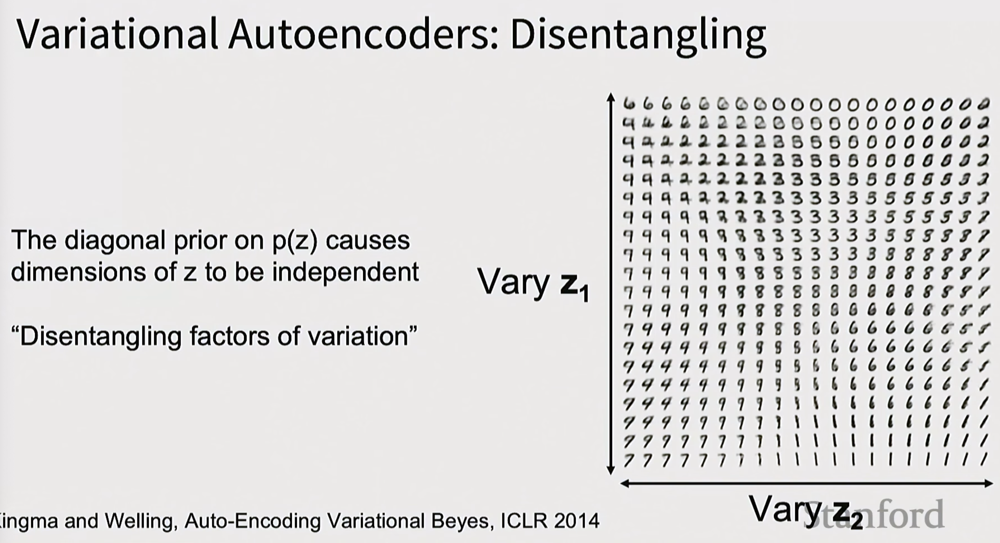
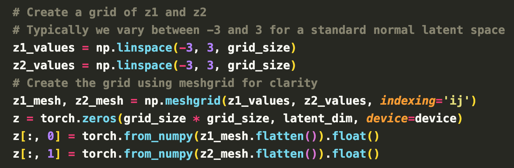

# Implementation

## Pseudo Code

### **Encoder**

- The input image dimension is [$B$, $C$, $H$, $W$]. In this project, we use the MNIST dataset, where each image is grayscale and has spatial resolution $28\times28$.
- A modified ResNet-18, pre-trained on ImageNet, is used as the encoder. The original classification head (`fc`) is replaced to produce the mean (`mu`) and log-variance (`logvar`) required for the VAE's reparameterization trick.
- The flow of encoder:`Image → Modified ResNet → Project → Chunk →` `mu`, `logvar`
    - $[1, 28, 28]$ $\xrightarrow{\displaystyle \textsf{ResNet}}$ [1, 1024] $\xrightarrow{\displaystyle \textsf{Project}}$ $[1, 256]$ $\xrightarrow{\displaystyle \textsf{Chunk}}$ $([1, 128], [1, 128])$

### **Decoder**

- The decoder consists of one `MLP` layer followed by several convolutional layers (`Conv`) with upsampling (`Up`).
- The flow of decoder: `Project -> Reshape -> Nx Conv+Up`
- The input to the decoder is the latent code $z$. The latent dimension is [$B$, $D_{in}$] ($D_{in}$ default to 128)
    1. First it passes through a `MLP` → [$B$, $D_{out}$] 
    2. Reshape from [$B$, $D_{out}$] → $[B, C_{init}, H_{init}, W_{init}]$, where $H_{init}=W_{init}$
- Then it passes through $N$ layers of Convolution + Up-sampling layer → $[B, 1, H_{out}, W_{out}]$, where $H_{out}=W_{out}=28$

### **VAE**

- The VAE takes data from MNIST dataset then pass it through a ResNet encoder. The encoder outputs the parameters $\mu$ and $\sigma$.
- Then sample latent code $z$ using $z = \mu +\sigma\cdot\epsilon$ where $\epsilon \sim N(0, I)$.
- Then pass $z$ to the decoder.

### **Training**

1. Run input data $x$ through encoder to get distribution over $z$.
2. Use prior loss to enforce the encoder outputs to follow a unit Gaussian distribution (zero mean, unit variance).
3. Sample $z$ from encoder output $q_\phi(z\mid x)$ (Reparameterization trick).
4. Run $z$ through decoder to get predicted data mean (Reconstruction).
5. Use reconstruction loss to make predicted mean match $x$ under an L2 objective.

## Elaboration

### 1. The Core Concept

Unlike standard Autoencoders which map `Image` $\to$ `Code` $\to$ `Image`, a VAE maps **`Image` $\to$ `Distribution Parameters` $\to$ `Image`**.

The networks do not output probabilities directly; they output the **parameters** (Mean $\mu$ and Standard Deviation $\sigma$) of Gaussian distributions.

### 2. The Encoder (Inference Model)

The encoder compresses high-dimensional data into a low-dimensional latent space.

- **Input:** Image of shape $3 \times H \times W$.
- **Output:** Two vectors, both of length **$D$** (the latent dimension, e.g., 128).
    1. **Mean Vector ($\mu_z$):** The center of the latent distribution.
    2. **Log-Variance Vector ($\log \sigma^2_z$):** The spread of the distribution.
- Design Choice of using Diagonal Covariance:
    
    We assume the dimensions of $z$ are statistically independent. Instead of predicting a full $D \times D$ covariance matrix (which would handle correlations between features), we only predict the diagonal.
    
- **Intuition:** This drastically reduces parameters from quadratic ($D^2$) to linear ($D$), making the model easier to train.

### **3. The Reparameterization Trick**

The reparameterization trick is a tactical solution to a technical problem: **How do we backpropagate through a random node?**

- **The Issue:** Inside the network, we need to sample $z$ from the distribution $q_\phi(z|x)$ (typically a Gaussian with mean $\mu$ and variance $\sigma^2$. Standard random sampling breaks the chain of derivatives needed for backpropagation.
- **The Trick:** We move the randomness to an external variable $\epsilon$ that is independent of the model parameters.
- **The Equation:** Instead of sampling $z \sim N(\mu, \sigma^2)$ directly, we calculate:
$z = \mu + \sigma \odot \epsilon$ where $\epsilon \sim N(0, 1)$ (standard normal distribution).

This allows gradients to flow through $\mu$ and $\sigma$ during training, making the VAE end-to-end differentiable.

### 4. The Decoder (Generative Model)

The decoder reconstructs the image from a sampled latent point.

- **Input:** A vector $z$ of length **$D$** (sampled from the Encoder's distribution).
- **Output:** A tensor of shape **$3 \times H \times W$** (same as input image).
- What this output represents:
    
    Mathematically, this output is the Mean Vector ($\mu_x$) of the pixel probability distribution.
    
- Design Choice (Fixed Variance):
    
    We assume the pixel distribution is a Gaussian with a fixed standard deviation of 1 ($\sigma=1$) and spherical covariance (no correlations between pixels).
    

### 5. Critical Intuition: Why Design it This Way?

**A. Why Diagonal/Fixed Covariance? (The "Unmanageable Size" Problem)**

- If the Decoder tried to learn the correlations between every pair of pixels (**Full Covariance**), it would need a matrix of size $(H \cdot W)^2$.
- For a small image, this is millions of parameters; for large images, trillions.
- **Solution:** By assuming pixels are independent (Diagonal) or fixed (Spherical), we reduce complexity from **Quadratic** to **Linear**.

**B. Why NOT Predict Separate Variances for Each Pixel? (The "Cheating" Problem)**

- **The Idea:** Why not let the decoder output a specific variance $\sigma_i$ for every pixel $i$?
- The Cheating Mechanism:
    
    As derived in the Appendix, the Loss function includes two competing terms:
    
    $$
    \text{Loss} \approx \underbrace{\frac{(x - \mu)^2}{2\sigma^2}}_{\text{Reconstruction Error}} + \underbrace{\log(\sigma)}_{\text{Uncertainty Penalty}}
    $$
    
    - **How it cheats:** For difficult details (like edges), the reconstruction error $(x-\mu)^2$ is naturally high. To minimize the Loss, the model can simply predict a **massive variance ($\sigma \to \infty$)**.
    - **The Result:** A huge $\sigma$ crushes the Reconstruction Error term to near zero. It is "cheaper" for the model to admit total uncertainty than to learn the hard feature.
- **The Fix:** By forcing $\sigma=1$, the denominator is constant. The model *must* minimize $(x - \mu)^2$ to lower the loss.

**C. Why is the "Reconstructed Image" just the Mean? (The MSE Connection)**

- When you maximize the likelihood of a Gaussian where $\sigma$ is fixed to 1, the math simplifies to:
    
    $\text{Maximize } \log P(x|z) \iff \text{Minimize } (x - \mu)^2$
    
- Therefore, the output $\mu$ is the value that minimizes the **Mean Squared Error (L2 Loss)**.

# Motivation of VAE

While standard auto-encoders are effective for learning feature representations (via reconstruction), they fail as generative models because their latent space ($Z$) has no enforced structure. Starting at **[[51:18](http://www.youtube.com/watch?v=zbHXQRUNlH0&t=3078)].**

- **The Limitation of Autoencoders [[51:18](http://www.youtube.com/watch?v=zbHXQRUNlH0&t=3078)]:** if you want to use a standard autoencoder to generate *new* data, you would need to throw away the encoder and sample a latent vector $Z$ to pass through the decoder. However, because the autoencoder places no constraints on the latent space, you have no idea what the distribution of valid $Z$ vectors looks like.
- **"Kicking the Can Down the Road" [[51:57](http://www.youtube.com/watch?v=zbHXQRUNlH0&t=3117)]:** just as we didn't know the distribution of the original data $X$, we now don't know the distribution of the latent vectors $Z$. Therefore, we are "stuck" because we cannot easily sample a valid code to generate a realistic image.
- **The VAE Solution [[52:14](http://www.youtube.com/watch?v=zbHXQRUNlH0&t=3134)]:** The motivation for the VAE is to "force some structure on the $Z$'s." By forcing the latent space to approximate a known distribution (typically a unit Gaussian), the VAE ensures that we *can* easily sample a random $Z$ from that known distribution and pass it through the decoder to generate valid new data.

VAEs are essentially a "probabilistic spin" on traditional autoencoders designed specifically to enable this sampling capability **[[53:08](http://www.youtube.com/watch?v=zbHXQRUNlH0&t=3188)]**.

# Formulation

## Goal — Maximize Marginal Likelihood

We want to find parameters $\theta$ such that the data we observed ($x$) is highly probable under our model. We maximize the **Marginal Likelihood**, not the Conditional Likelihood.

- Equation: $\theta^* = \operatorname*{argmax}_\theta \sum_{i} \log p_\theta(x^{(i)})$
- Why Marginal $p_\theta(x)$: The "marginal" integrates over **all possible** latent variables $z$.
    - **$p(x\mid z)$ (Single Case):** This asks, "How likely is this image if the hidden concept is **exactly** $z$?"
    - **$p(x)$ (Collectively all cases):** This asks, "How likely is this image considering **every possible** hidden concept that could produce it?" i.e. $p(x) = \int p(x|z)p(z)dz$.
    
    | **Symbol** | **Name** | **Description** |
    | --- | --- | --- |
    | **$p_\theta(x \mid z)$** | **Likelihood** | How likely is the image $x$, given the hidden traits $z$? |
    | **$p_\theta(z)$** | **Prior** | What is the distribution of hidden traits $z$ before seeing data? |
    | **$p_\theta(z \mid x)$** | **Posterior** | Given the image $x$, what are the likely traits $z$? |
    | **$p_\theta(x)$** | **Marginal Likelihood** | How probable is the data $x$ overall, summing over all possible $z$'s? |
- Why $p_\theta(x)$ is called marginal likelihood?
    
    Historically, probability distributions were written in **tables**. For example, if you had a joint distribution over $x$ and $z$:
    
    |  | z=0 | z=1 | **Row total** |
    | --- | --- | --- | --- |
    | x=0 | … | … | **p(x=0)** |
    | x=1 | … | … | **p(x=1)** |
    | **Column total** | **p(z=0)** | **p(z=1)** | 1 |
    
    To get the probability of $x$ alone, you would **sum across the row**, and the result would appear in the **margin** of the table. Hence: **Summing out a variable = looking at the margin of the joint distribution.** That operation was literally written in the *margins* of the table → “**marginal** probability.” The process of computing it → “**marginalization**.”
    

## Blocker ← The Intractability

To calculate the marginal likelihood, we face a mathematical dead end because we cannot compute the integral or the posterior.

- The Integral Problem: $p_\theta(x) = \int p_\theta(x|z)p(z) \, dz$
    
    For complex data (like images), this integral is impossible to calculate (intractable) because it requires summing over an infinite number of possible $z$ configurations.
    
- The Bayes' Rule Problem:
    
    We might try to find $p_\theta(x)$ via Bayes' Rule:
    
    $$
    p_\theta(x) = \frac{p_\theta(x\mid z)p(z)}{p_\theta(z\mid x)}
    $$
    
    However, we only have a decoder to compute $p_\theta(x\mid z)$. To compute the denominator $p_\theta(z|x)$ (the true posterior), we need to use the Bayes’ rule which requires knowing $p_\theta(x)$, $p_\theta(z\mid x) = \frac{p_\theta(x\mid z)p(z)}{p_\theta(x)}$, so it is intractable.
    

## Solution ← Variational Inference (Replacing $p_\theta$ with $q_\phi$)

Since the true posterior $p_\theta(z|x)$ is impossible to calculate, we **approximate** it with a tractable distribution $q_\phi(z|x)$ (the Encoder/Neural Network).

- The Approximation: $q_\phi(z|x) \approx p_\theta(z|x)$

---

# Intuition

## **The reconstruction loss and prior loss is fighting with each other**


This "tug-of-war" is one of the most fascinating parts of a VAE because you can actually *see* the result of these two forces fighting when you plot the latent space.

Here is the visual evidence that the KL divergence doesn't just "force" everything to zero, but rather organizes it.

### 1. The "Healthy" VAE Balance

When the Reconstruction Loss (keep data distinct) and KL Loss (keep data Gaussian) are balanced correctly, the latent space looks like this:

**What to notice:**

- **Global Centering:** Notice that the *entire cloud* of points is centered around $(0,0)$ and roughly spans between $-3$ and $3$ (typical for a unit variance). This is the KL loss doing its job.
- **Local Distinctness:** Crucially, individual digits are **not** all collapsed to $(0,0)$. The "7"s might be clustered at $(-1, 2)$ and the "0"s at $(1, -1)$. The encoder has learned to shift the mean $\mu$ *away* from 0 just enough to distinguish the digits, but keeps them packed tight enough to satisfy the Gaussian prior.
- **Smoothness:** The clusters touch each other. This means if you sample a point halfway between a "1" and a "7", you get a digit that looks like a plausible mix of both.

---

### 2. What happens *without* the KL "Force" (Standard Autoencoder)

If you remove the KL term (essentially predicting mean/variance but with no penalty for where they are), the Reconstruction Loss takes over completely.

**What to notice:**

- **Gaps and Explosions:** The clusters fly apart. The model might put "0"s at $(100, 100)$ and "1"s at $(-50, -50)$ just to be absolutely sure it doesn't confuse them.
- **No Structure:** There is no center. The spread is arbitrary.
- **Dead Zones:** There are massive empty gaps between clusters. If you try to generate an image from those gaps, you get static/noise because the decoder has never seen data there.

### 3. What happens if the KL Force Wins (Posterior Collapse)

This is the scenario you feared—where the model is "forced" to 0 and 1.

- **The Visual:** Imagine the first plot, but all the colored clusters are stacked directly on top of each other at $(0,0)$.
- **The Result:** The encoder output is always $\mu=0, \sigma=1$ effectively ignoring the input image. The decoder receives pure noise every time and produces a single, blurry "average" image (like a gray ghost) for every single input.

### 4. Summary

The KL divergence acts like a **spring** attached to the origin $(0,0)$.

- **Reconstruction** tries to pull the data points apart so they don't overlap.
- **KL Divergence** (the spring) pulls them back toward the center.
- The final state is a tense equilibrium: data points distinct enough to be recognized, but bunched tight enough to form a smooth, continuous space.

## Role of $z_i$ in latent code $Z$



Auto-Encoding Variational Bayes, ICLR 2014.

In a Variational Autoencoder (VAE), **$Z$** represents the latent code—a compressed, hidden representation of the input data. **$z_i$** refers to a specific individual dimension (or component) within this vector. The core idea shown here is **disentanglement**: the model attempts to map distinct, meaningful semantic features of the data to separate dimensions ($z_i$). For example, changing the value of one dimension ($z_1$) might smoothly transform the digit's identity (e.g., changing a 6 to a 0), while changing another dimension ($z_2$) might strictly alter the slant or thickness of the writing, without changing the digit itself.



Implementation of sampling $z_1$ and $z_2$ and set rest of $z_i$ to zeros.

# Limitation: Blurry results (i.e. What’s Next?)

The nature of loss function (MSE/log-likelihood) tend to produce "blurry" results in VAE.

The "blurry VAE" phenomenon is a direct mathematical consequence of how we measure "error" using **Mean Squared Error (MSE)** or **Log-Likelihood**.

In short: **MSE forces the model to be a conservative "average," rather than a bold "guesser."**

Here is the breakdown of why this happens.

### 1. The "Safety" of the Average

Imagine the model is trying to reconstruct a picture of a zebra, but the latent space is slightly uncertain about exactly where a specific stripe should be.

- **Possibility A:** The stripe is at pixel 100.
- **Possibility B:** The stripe is at pixel 101.

If the model guesses A (sharp stripe at 100), but the truth was B, the MSE penalty is massive because the pixel values are totally opposite (black vs. white).

If the model guesses B (sharp stripe at 101), but the truth was A, the penalty is essentially double (wrong on both pixels).

**The VAE's Solution:** It predicts a **gray smear** across pixels 100 and 101.

- **Why?** Gray is never "perfectly right," but it is never "catastrophically wrong." It minimizes the *squared* error across all plausible possibilities. The model learns to **hedge its bets** to lower the loss.

### 2. The Unimodal Assumption (Mathematics)

This is the technical root of the problem.

- **MSE is equivalent to Maximum Likelihood under a Gaussian distribution.**
- When you use MSE, you are implicitly telling the model: *"Assume the pixel value comes from a single Bell curve (Unimodal)."*

The Problem: Real data is Multimodal.

A pixel at the edge of an object could plausibly be Black (background) OR White (object). It is almost never Gray.

- **Multimodal Reality:** Two peaks (one at 0, one at 255).
- **Unimodal Constraint:** The model must fit *one* Bell curve to explain both peaks.
- **Result:** The model centers the Bell curve right in the middle (Gray/Blur) to cover both options.

### 3. High Frequency vs. Low Frequency

- **Low Frequency (Structure):** Where is the head? Where is the background? VAEs are great at this because the "average" of a head is still roughly a head shape.
- **High Frequency (Texture/Edges):** Where is this specific hair strand? Where is the pore on the skin? The "average" of many possible hair strand positions is just a smooth blur. Since VAEs optimize for the average case, they effectively apply a **low-pass filter** to the image, smoothing out all the sharp "high frequency" noise that our eyes interpret as realistic detail.

### Comparison: Why GANs don't blur

- **VAE (MSE):** "I must be close to the pixel values on average. I will be safe and blurry."
- **GAN (Discriminator):** "I don't care if the stripe is at pixel 100 or 101, but if it's gray/blurry, the Discriminator will know it's fake. I must pick **one** sharp location, even if I guess wrong."

| **Loss Function** | **Strategy** | **Result** |
| --- | --- | --- |
| **MSE / L2** | Minimize variance; fit the mean of the distribution. | **Blurry.** The mean of "sharp left" and "sharp right" is "blurry middle." |
| **L1 Loss** | Minimize absolute error; fit the *median*. | **Slightly sharper**, but still blurry compared to GANs. |
| **Adversarial** | Fool a judge; match the *distribution*. | **Sharp.** Forces a decision (collapse to a mode) rather than an average. |

**The Perceptual Loss (VGG Loss)** or **VQ-VAE** are the standard modern techniques specifically designed to fix this blurriness in VAEs without needing a full GAN setup.

# Citation

Please cite this work as:

```latex
Bai, Yechao. "Dimistify VAE: Intuition, Math, and Implementation". Yechao's Log (Jan 2026).
```

Or use the BibTex citation:

```latex
@article{Bai2026VAE,
  title = {Dimistify VAE: Intuition, Math, and Implementation}, https://bai-yunhan.github.io/posts/vae-variational-auto-encoder
  author = {Bai, Yechao},
  journal = {bai-yunhan.github.io},
  year = {2026},
  month = {Jan},
  url = "https://bai-yunhan.github.io/posts/vae-variational-auto-encoder/"
}
```

# **Retrospection**

- **Question-1:** In a VAE, does the KL term make each class (e.g., each digit 0–9) form its own Gaussian cluster in latent space near zero, such that the *mixture* of the 10 class-wise clusters matches a standard normal, and the class separability comes from different encoder-produced $\mu$ and $\sigma$?
    
    Concretely, We sample $z$ from the encoder, $z \sim q_\phi(z|x)$, where $q_\phi(z|x)$ is a gaussian distribution, i.e. $z \sim N(\mu, \sigma^2)$. We use KL divergence loss to make $N(\mu, \sigma^2)$ look similar to a standard gaussian distribution. $z$ is a latent code (vector of length $D$). Say, we are reconstructing hand written digit of 10 classes (digit 0 ~ 9). The $z$ representing digit $0$ is a gaussian distribution, and the $z$ representing digit $1$ is another gaussian distribution. These cluster both locate near to zero mean. The totality of the 10 cluster conform to the standard gaussian distribution. The distinctiveness between each cluster comes from the difference in $\mu$ and $\sigma$ generated by the encoder.
    
- **Answer: T**he understanding is correct.
    
    **In summary, the VAE is a Master of Compromise**
    
    - The VAE does **clustering** (via the reconstruction term), where each class (digit) gets its own localized cluster defined by its mean $\mu$.
    - The VAE does **regularization** (via the KL term), ensuring that all these clusters stay packed together in a smooth, continuous space that collectively resembles the $N(\mu, \sigma^2)$ distribution.
    1. **The Local View (Individual Input)**
    For any single input (e.g., a specific image of a digit '2'), the encoder outputs a specific $\mu$ and $\sigma$.
        - This defines a **"neighborhood"** in the latent space where that specific image lives.
        - By sampling $z$ from this neighborhood, the decoder learns that any point in this small area should look like *that specific* '2'.
    2. **The Class View (Group of Inputs belong to same class)**
    As you noted, all the '2's will have their own $\mu$ and $\sigma$ values.
        - Because they all share similar visual features, the Reconstruction Loss naturally forces their $\mu$ values to be near each other.
        - This creates a **cluster** (a Gaussian Mixture component) for the digit '2'.
    3. **The Global View (The Prior)**
    The **KL Divergence** is the "global supervisor." It doesn't care about the labels (0–9); it only sees the totality of all these neighborhoods.
        - It exerts a pull on **every** individual distribution to stay close to $0$ and have a spread near $1$.
        - The result is that the "cloud of clusters" (the totality) conforms to the standard Gaussian shape.
    
    **A Helpful Mental Model: "The Bubble Map"**
    Imagine each input image is a **bubble**.
    
    - The **Reconstruction Loss** wants the bubbles to be solid and distinct so the decoder can "see" the image clearly.
    - The **KL Loss** wants all the bubbles to move to the center of the map and be exactly the same size.
    - **The Training Process** is the struggle to pack all these bubbles into a small, circular container (the Standard Normal Prior) without them overlapping so much that they lose their identity.
- **Question-2:** What is the use of the randomness in VAE ?
    
    Concretely, let’s say we are reconstructing hand written digit of 10 classes (digit 0 ~ 9).
    
    Regarding the encoder, when given 10 input images of digit ‘1’, the output $\mu$ and $\sigma$ would be very close if not the same. Namely, the latent code $z$ of the image of digit ‘1’ belong to the same cluster. Am i right?
    
    During inference, if we feed the same image of ‘1’ to the encoder, though the $\mu$ and $\sigma$  output by encoder is the same, due to the randomness of $\epsilon$, the output $z$ would be different. namely, the latent code for the same input image is not deterministic. Am i right? In contradiction, for auto-encoder, the latent code for the same input image is deterministic. What is the use of the randomness?
    
- **Answer:** Randomness is the heart of the VAE magic.
    
    **1. Verification of Intuition**
    
    **Point 1: Do 10 images of digit '1' cluster together?**
    
    - **Yes, you are right.**
    - The encoder will map all distinct images of '1' to values of $\mu$ and $\sigma$ that are close to each other in the latent space.
    - *Nuance:* They won't be *exactly* the same. One '1' might be slanted (mapping to slightly left in the cluster), and another might be bold (mapping to slightly right). The VAE captures these stylistic differences in the precise values of $\mu$.
    
    **Point 2: Is the latent code $z$ stochastic for the same image?**
    
    - **Yes, you are right.**
    - If you feed the exact same image into a VAE multiple times (and you are using the sampling step), you will get a slightly different vector $z$ each time because of the random noise $\epsilon$.
    - *Note:* In practical deployment (e.g., if using a VAE just to compress data), engineers often skip the sampling and just use $\mu$ to get a deterministic code. But strictly speaking, the mathematical definition of the VAE inference path involves this randomness.
    
    **2. The Core Question: What is the use of the randomness?**
    
    You asked: *"For auto-encoder, the latent code is deterministic. What is the use of the randomness?"*
    This is the most critical concept in VAEs. The randomness transforms the latent space from a **discrete lookup table** into a **continuous landscape**.
    Here is the analogy: **The Dot vs. The Bubble.**
    
    **A. The Standard Autoencoder (The Dot)**
    
    - **Mechanism:** It maps an input image to a single, precise point (a dot) in space.
    - **The Problem:** The decoder only learns to decode *that specific point*.
    - **The Consequence:** If you sample a point just slightly next to that dot—in the "empty space" between a '1' and a '2'—the decoder has no idea what to do. It often produces garbage or static because it never learned to handle that specific coordinate during training. The latent space is full of "holes."
    
    **B. The VAE (The Bubble)**
    
    - **Mechanism:** By predicting a mean $\mu$ and variance $\sigma$ and adding noise, the encoder maps the input image not to a dot, but to a **cloud** or **bubble** of probability.
    - **The Effect:** During training, the decoder is forced to reconstruct the digit '1' not just from a single point $\mu$, but from *any* point sampled within that bubble $z$.
    - **The "Use" of Randomness:**
        1. **Forcing Continuity (Smoothness):** Because the decoder must reconstruct a '1' from anywhere inside the bubble, it learns that points *near* each other should produce similar outputs. This eliminates the "holes." If two bubbles (say, a '1' and a '7') overlap slightly, the decoder learns to generate a hybrid digit in that overlapping region.
        2. **Dense Packing:** The KL divergence (the "spring" we discussed earlier) tries to pack these bubbles as close to the center as possible without crushing them. Because they are bubbles (taking up volume) and not dots (infinitely small), they fill up the latent space completely.
    
    The randomness prevents the model from "memorizing" specific points. It forces the model to learn a **region** for each digit, ensuring that the latent space is smooth, continuous, and safe to sample from for generation.
    

# Appendix

## Derivation of the Gaussian Loss

Here is the derivation of why the loss function looks the way it does, starting from the definition of the Gaussian distribution.

**1. The Gaussian Probability Density Function (PDF)**

For a single pixel value $x$, modeled by a Gaussian with mean $\mu$ and standard deviation $\sigma$:

$$
P(x|\mu, \sigma) = \frac{1}{\sqrt{2\pi\sigma^2}} \cdot e^{-\frac{(x - \mu)^2}{2\sigma^2}}
$$

**2. Log-Likelihood**

To train models, we want to maximize the probability of the true data. We take the Logarithm to make the math easier (Log is monotonic, so maximizing Log($P$) is the same as maximizing $P$).

$$
\log P(x) = \log\left(\frac{1}{\sqrt{2\pi\sigma^2}}\right) + \log\left(e^{-\frac{(x - \mu)^2}{2\sigma^2}}\right)
$$

Using logarithm rules $\log(e^y) = y$ and $\log(1/a) = -\log(a)$):

$$
\log P(x) = -\frac{1}{2}\log(2\pi\sigma^2) - \frac{(x - \mu)^2}{2\sigma^2}
$$

**3. Negative Log-Likelihood (The Loss)**

In Deep Learning, we minimize Loss, which is the `Negative Log-Likelihood`. We flip the signs:

$$
\text{Loss} = \underbrace{\frac{1}{2}\log(2\pi)}_{\text{Constant}} + \underbrace{\log(\sigma)}_{\text{Variance Term}} + \underbrace{\frac{(x - \mu)^2}{2\sigma^2}}_{\text{Error Term}}
$$

**4. Simplified Loss for Analysis**

Ignoring the constant (since it doesn't change with weights), we get the equation used in the "Cheating" section:

$$
\text{Loss} \propto \frac{(x - \mu)^2}{2\sigma^2} + \log(\sigma)
$$

## Derivation of the ELBO (Evidence Lower Bound)

The lecture did a great job in explaining ELBO. [1:03:04 to 1:08:55]

$$
\log p_\theta(x) = \log \frac{p_\theta(x|z) p(z)}{p_\theta(z|x)}
$$

Multiply top and bottom by $\textcolor{lightblue}{q_\phi(z|x)}$

$$
\log p_\theta(x) = \log \frac{p_\theta(x|z)p(z)}{p_\theta(z|x)} = \log \frac{p_\theta(x|z)p(z)\textcolor{lightblue}{q_\phi(z|x)}}{p_\theta(z|x)\textcolor{lightblue}{q_\phi(z|x)}}
$$

Logarithms + rearranging:

$$
\begin{align*} \log p_\theta(x) &= \log \frac{p_\theta(x \mid z)p(z)}{p_\theta(z \mid x)} = \log \frac{\textcolor{cyan}{p_\theta(x \mid z)}\textcolor{green}{p(z)}\textcolor{red}{q_\phi(z \mid x)}}{\textcolor{yellow}{p_\theta(z \mid x)}\textcolor{lightblue}{q_\phi(z \mid x)}} \\[12pt] &= \log \textcolor{cyan}{p_\theta(x \mid z)} - \log \frac{\textcolor{lightblue}{q_\phi(z \mid x)}}{\textcolor{green}{p(z)}} + \log \frac{\textcolor{red}{q_\phi(z \mid x)}}{\textcolor{yellow}{p_\theta(z \mid x)}} \end{align*}
$$

[1:04:01 - 1:04:58] We can wrap in an expectation since it doesn’t depend on $z$: $\log p_\theta(x) = E_{z \sim q_\phi(z \mid x)}\left[\log p_\theta(x)\right]$. **The expectation (average) of a constant value is just the constant itself.** 

- In the notation $E_{z \sim q_\phi(z \mid x)}\left[\log p_\theta(x)\right]$:
    - $z$ is indeed sampled from the distribution $q_\phi$.
    - It is conditioned on the input $x$ ("given x").
    - $q_\phi(z \mid x)$ is the **Encoder.**
    - **In plain English:** "We are going to calculate the average value of [whatever term follows] by trying out many different latent codes ($z$) that our Encoder thinks are likely for this specific image ($x$)."
- The term they are looking at is **logP(x)**. This represents the probability of the image (data) occurring.
- The variable **$z$** represents the latent code (hidden features).
- **Crucially:** $\log P(x)$ depends *only* on the data $x$. It does **not** depend on $z$.
- Therefore, relative to $z$, the term $\log P(x)$ is a **constant**.

$$
\log p_\theta(x) = E_z[\log p_\theta(x \mid z)] - E_z \left[ \log \frac{q_\phi(z \mid x)}{p(z)} \right] + E_z \left[ \log \frac{q_\phi(z \mid x)}{p_\theta(z \mid x)} \right]
$$

The 2nd and 3rd term are KL divergence which measures dissimilarity between two probability distributions.

$$
\begin{align*}
\log p_{\theta}(x) &= \log \frac{p_{\theta}(x \mid z)p(z)}{p_{\theta}(z \mid x)} = \log \frac{p_{\theta}(x \mid z)p(z)q_{\phi}(z \mid x)}{p_{\theta}(z \mid x)q_{\phi}(z \mid x)} \\
&= E_{z}\left[\log p_{\theta}(x \mid z)\right] - E_{z}\left[\log \frac{q_{\phi}(z \mid x)}{p(z)}\right] + E_{z}\left[\log \frac{q_{\phi}(z \mid x)}{p_{\theta}(z \mid x)}\right] \\
&= E_{z \sim q_{\phi}(z \mid x)}\left[\log p_{\theta}(x \mid z)\right] - D_{KL}\left(q_{\phi}(z \mid x), p(z)\right) + D_{KL}\left(q_{\phi}(z \mid x), p_{\theta}(z \mid x)\right)
\end{align*}
$$

$E_{z \sim q_{\phi}(z \mid x)}\left[\log p_{\theta}(x \mid z)\right]$: The data reconstruction term. x→encoder→decoder should reconstruct $x$. Can compute in closed form for Gaussians.

$D_{KL}\left(q_{\phi}(z \mid x), p(z)\right)$: The prior term. We are forcing the Encoder to organize its output (i.e. the hidden codes $z$) so that, overall, they form a nice, neat Standard Gaussian distribution. Can compute in closed form for Gaussians.

- **The "Encoder Output":** This is $q_\phi(z \mid x)$. When you feed an image $x$ into the encoder, it doesn't just give you a single point; it gives you a **probability distribution** (specifically, it predicts a mean $\mu$ and a variance $\sigma^2$ for that image).
- **The "Prior":** This is $p(z)$. We assume this is a **Standard Unit Gaussian** (a bell curve centered at 0 with a width of 1).
- **The "Match":** The goal of training is to minimize the difference (KL Divergence) between the two.

$D_{KL}\left(q_{\phi}(z \mid x), p_{\theta}(z \mid x)\right)$: Posterior Approximation. Encoder output $q_\phi(z\mid x)$ should match $p_\theta(z\mid x)$. We cannot compute this for Gaussians. 

- KL is ≥ 0, so we can drop it to get lower bound on likelihood.

This is out VAE training objective. Jointly train encoder $q$ and decoder $p$ to maximize the variational lower bound on the data likelihood. Also called Evidence Lower Bound (ELBo)

$$
\log p_{\theta}(x) \geq E_{z \sim q_{\phi}(z|x)} \left[ \log p_{\theta}(x|z) \right] - D_{KL} \left( q_{\phi}(z|x), p(z) \right)
$$

